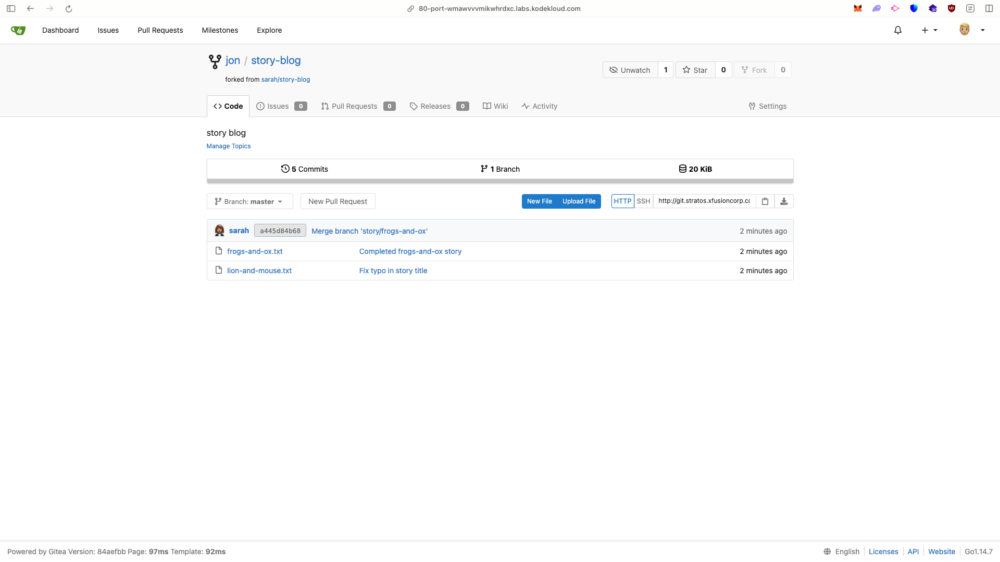

# Report: Forking Repository for User `jon` in Gitea

## Objective

Developer **Jon** required a forked copy of the `sarah/story-blog` repository on the Gitea Git server to begin development.

---

## Steps Performed

### 1. Accessed Gitea UI

* Clicked on the **Gitea UI** button from the top bar.
* Logged in with credentials:

  * **Username:** `jon`
  * **Password:** `Jon_pass123`

✅ Successfully logged in as **Jon**.

---

### 2. Located Repository `sarah/story-blog`

* Navigated to **Explore → Repositories**.
* Found and opened the repository named **`sarah/story-blog`**.

---

### 3. Forked the Repository

* Opened the repository page.
* Clicked **Fork** button (top right).
* Selected **jon** as the fork target.

✅ Repository successfully forked under Jon’s account.

---

### 4. Verification

* Navigated to **Jon’s Profile → Repositories**.
* Confirmed the presence of **jon/story-blog**.
* Verified it is a fork of **sarah/story-blog**.

---

## Final State

* Repository **`sarah/story-blog`** forked successfully under user **Jon**.
* Jon now has his own copy at **`jon/story-blog`** where he can clone, commit, and push changes.
