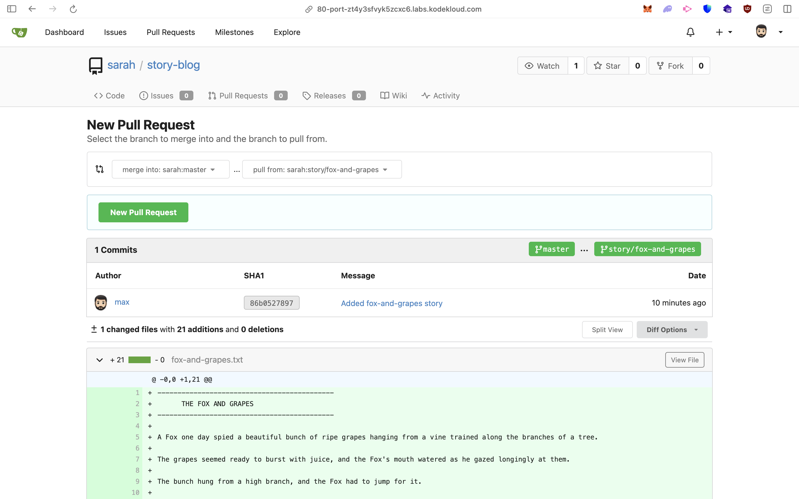
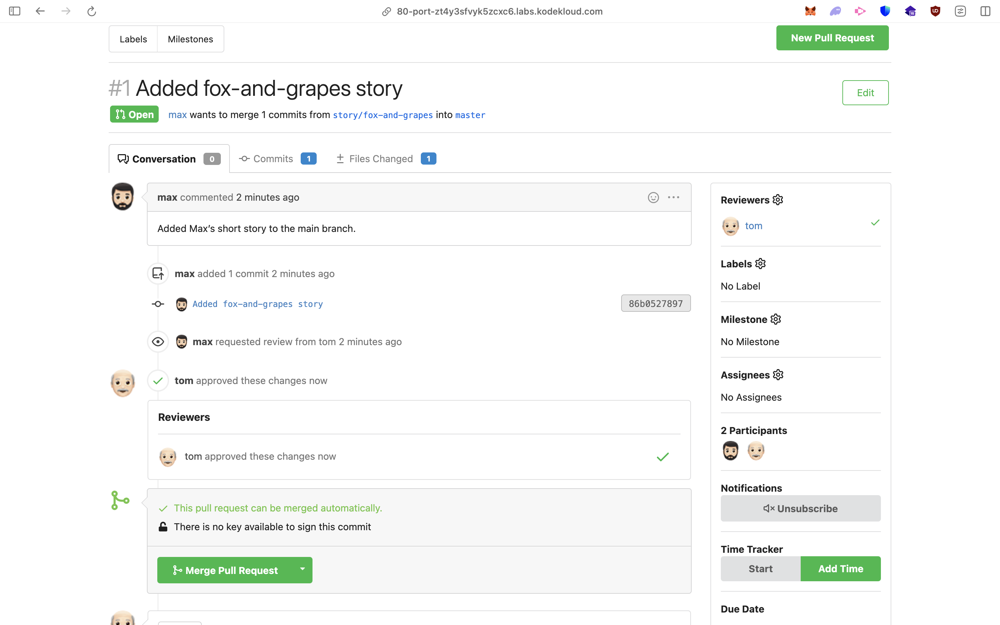
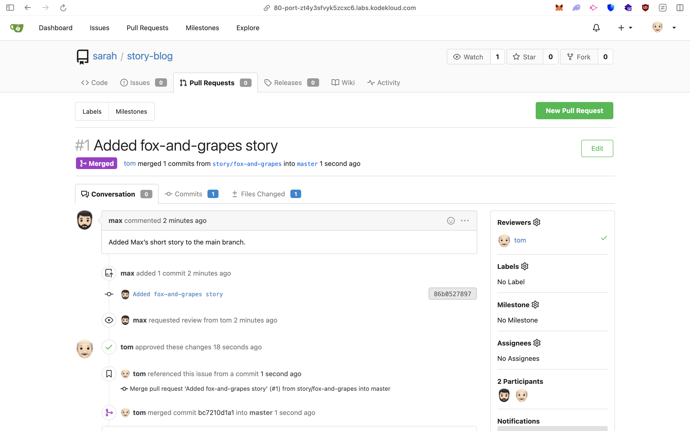

# 🦊 Git Pull Request Report – “Fox and Grapes” Story

### **Environment**

* **Server:** `ststor01`
* **User:** `max`
* **Repository:** `story-blog`
* **Branch:** `story/fox-and-grapes`
* **Remote Platform:** Gitea (Nautilus Project)

---

## **1. SSH Access and Repository Verification**

**Command Used:**

```bash
ssh max@ststor01
```

**Verification Steps:**

```bash
cd story-blog/
sudo git branch
sudo git log --oneline --graph --all
```

**Output:**

```
  master
* story/fox-and-grapes
* 86b0527 (HEAD -> story/fox-and-grapes, origin/story/fox-and-grapes) Added fox-and-grapes story
*   e19d816 (origin/master, origin/HEAD, master) Merge branch 'story/frogs-and-ox'
|\  
| * 30aacdc Completed frogs-and-ox story
| * 6fca32e Add incomplete frogs-and-ox story
* | a45e0f6 Fix typo in story title
|/  
* 2ac865f Added the lion and mouse story
```

✅ Verified that the repository contains:

* Existing stories: `lion-and-mouse`, `frogs-and-ox`
* New story: `fox-and-grapes` (added by Max)
* Branches: `master`, `story/fox-and-grapes`

> **Note:** Task description mentions *Sarah’s story*, but this is a template reference.
> In this environment, *Max’s story* (`fox-and-grapes`) replaces that.

---

## **2. Create Pull Request on Gitea**

**Steps:**

1. Logged into [Gitea UI](#) (🔒 Internal URL via “Gitea” button in lab)
2. Logged in as:

   * **Username:** `max`
   * **Password:** `Max_pass123`
3. Navigated to **story-blog repository**
4. Created new Pull Request:

| Field                  | Value                        |
| ---------------------- | ---------------------------- |
| **PR Title**           | `Added fox-and-grapes story` |
| **Source Branch**      | `story/fox-and-grapes`       |
| **Destination Branch** | `master`                     |




> 🖼️ *Figure 1 – Creating Pull Request for `story/fox-and-grapes` branch.*

---

## **3. Assign Reviewer**

**Steps:**

1. Inside the PR page → **Right Sidebar → Reviewers**
2. Added **tom** as a reviewer.


> 🖼️ *Figure 2 – Assigning `tom` as reviewer.*

---

## **4. Review and Merge PR**

**Steps (as user Tom):**

1. Logged out as Max.
2. Logged in as:

   * **Username:** `tom`
   * **Password:** `Tom_pass123`
3. Opened PR titled `Added fox-and-grapes story`.
4. Reviewed the story.
5. Approved and merged the PR into `master`.





> 🖼️ *Figure 3 – PR approved and merged by Tom.*

---

## **5. Verification**

Back on server:

```bash
git fetch origin
git checkout master
git log --oneline
```

**Expected Output:**

```
<commit-hash> Merge pull request #<id> from story/fox-and-grapes
86b0527 Added fox-and-grapes story
```

✅ Verified that the `fox-and-grapes` story is now merged into the master branch.

---

## **✅ Final Status**

| Step                       | Status |
| -------------------------- | ------ |
| Verify repository contents | ✅      |
| Create Pull Request        | ✅      |
| Assign reviewer (Tom)      | ✅      |
| Review & Merge PR          | ✅      |
| Confirm merge success      | ✅      |

---
