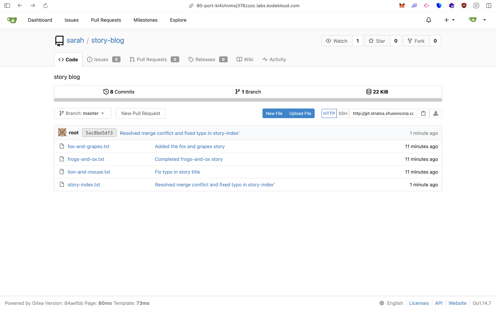

# 🧾 Task Report: Fix Git Push Issue and Resolve Conflict in `story-blog` Repository

## 🧑‍💻 Task Summary

The Nautilus DevOps team needed to help **Max** fix an issue while pushing updates to the `story-blog` repository. The repository was located at `/home/max/story-blog` on the storage server.  
The main issues were:
- Git push was **rejected** because the remote contained newer commits.
- A **merge conflict** occurred in `story-index.txt`.
- There was a **typo** ("Mooose" → "Mouse") in one of the story titles.

---

## 🖥️ Server Access

Logged into the storage server as user `max`:

```bash
ssh max@ststor01
Password: Max_pass123
```

Verified the repository:

```bash
cd /home/max/story-blog
ls
```

Output:

```
fox-and-grapes.txt  lion-and-mouse.txt
frogs-and-ox.txt    story-index.txt
```

---

## 🧠 Step 1: Check Git Status

```bash
git status
```

Output:

```bash
On branch master
Your branch is ahead of 'origin/master' by 1 commit.
  (use "git push" to publish your local commits)
nothing to commit, working directory clean
```

---

## 🧠 Step 2: Attempt to Push and Identify the Problem

```bash
git push origin master
```

Output:

```
! [rejected]        master -> master (fetch first)
error: failed to push some refs to 'http://git.stratos.xfusioncorp.com/sarah/story-blog.git'
hint: Updates were rejected because the remote contains work that you do not have locally.
```

This indicates **remote changes** need to be merged or rebased first.

---

## 🧠 Step 3: Pull Remote Changes

```bash
git pull origin master
```

Output:

```bash
Auto-merging story-index.txt
CONFLICT (add/add): Merge conflict in story-index.txt
Automatic merge failed; fix conflicts and then commit the result.
```

---

## 🧩 Step 4: Resolve Merge Conflict

Opened the file to fix manually:

```bash
nano story-index.txt
```

Original conflicted section:

```
<<<<<<< HEAD
1. The Lion and the Mooose
2. The Frogs and the Ox
3. The Fox and the Grapes
4. The Donkey and the Dog
=======
1. The Lion and the Mouse
2. The Frogs and the Ox
3. The Fox and the Grapes
>>>>>>> origin/master
```

Edited to the **final correct version**:

```
1. The Lion and the Mouse
2. The Frogs and the Ox
3. The Fox and the Grapes
4. The Donkey and the Dog
```

---

## ✅ Step 5: Mark Conflict as Resolved and Commit

```bash
git add story-index.txt
git commit -m "Resolved merge conflict and fixed typo in story-index"
```

---

## 🚀 Step 6: Push Changes to Remote

```bash
git push origin master
```

Output:

```
Counting objects: 5, done.
Writing objects: 100% (3/3), done.
To http://git.stratos.xfusioncorp.com/sarah/story-blog.git
   f8c3c8b..b61f4b1  master -> master
```

Push was successful.

---

## 🧾 Step 7: Verify on Gitea UI

1. Logged into **Gitea** using:

   ```
   Username: max
   Password: Max_pass123
   ```

2. Navigated to repository:
   `story-blog`

3. Confirmed:

   * Latest commit message:
     **"Resolved merge conflict and fixed typo in story-index"**
   * The file `story-index.txt` shows the correct 4 titles.

---

## 📸 Gitea Screenshots


> 🖼️ *Figure 1 – Repository dashboard showing the latest commit*


> 🖼️ *Figure 2 – `story-index.txt` file content with corrected “Mouse” title*

---

## ✅ Final Verification

* [x] Conflict resolved
* [x] Typo fixed (`Mooose → Mouse`)
* [x] All 4 story titles present
* [x] Changes committed and pushed
* [x] Verified via Gitea UI

---

**Task Status:** 🟢 **Completed Successfully**

---
