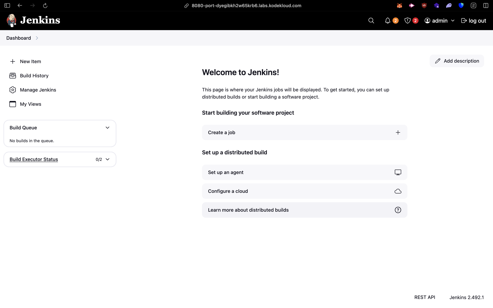
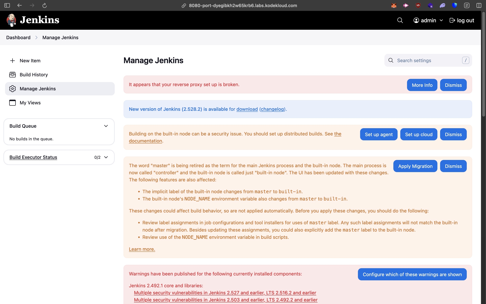
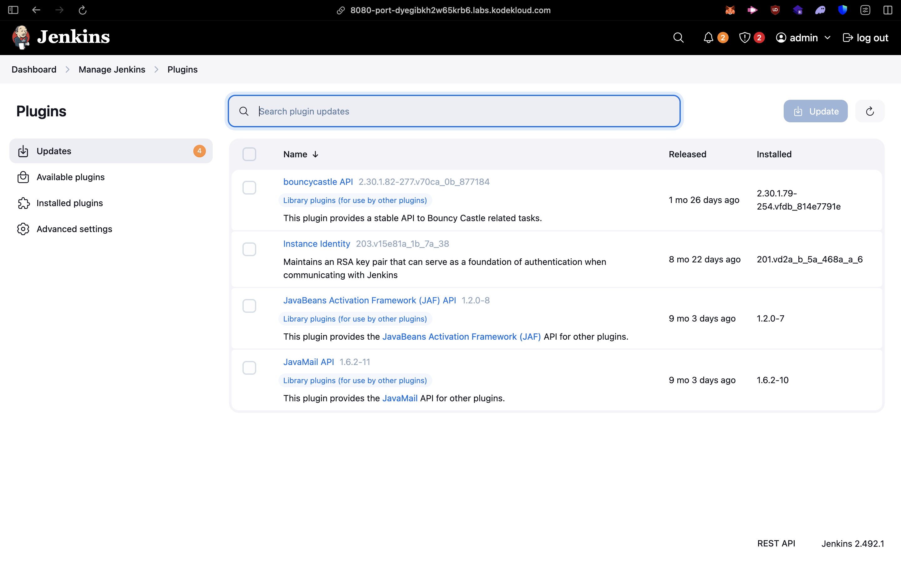
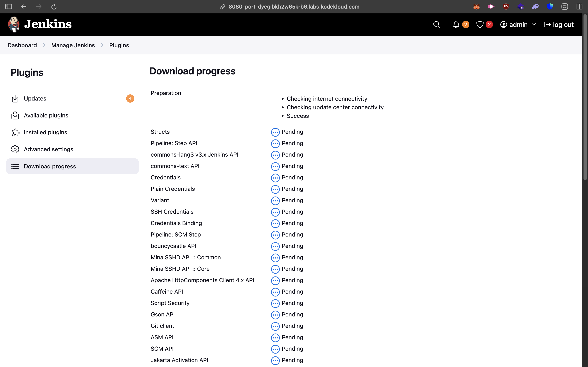
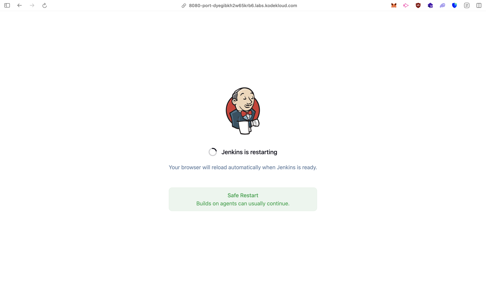
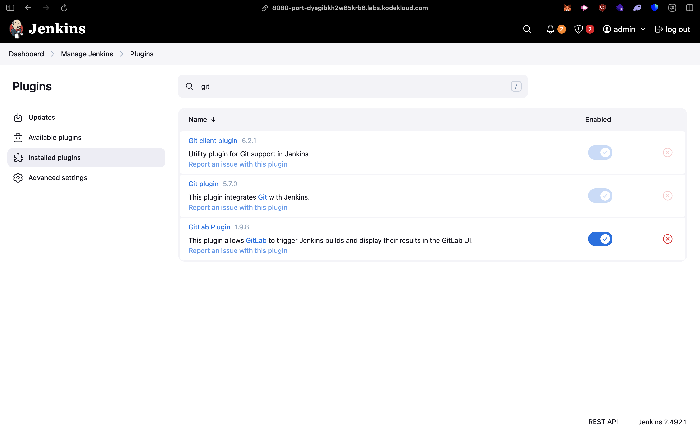

# Jenkins Plugin Installation Report

## Git and GitLab Plugins Setup

This report documents the full procedure for logging into the Jenkins UI, installing the required plugins, and restarting Jenkins if necessary.

---

## 1. Access Jenkins UI

1. Open your browser and visit your Jenkins server URL.

2. Login using the provided credentials:

   * Username: `admin`
   * Password: `Adm!n321`

3. Once logged in, you will land on the Jenkins dashboard.



---

## 2. Install Git and GitLab Plugins

1. From the Jenkins dashboard, navigate to:

   ```
   Manage Jenkins -> Plugins
   ```

   

2. Update the all plugins first

   

3. Go to the **Available** tab.

3. Search for the following plugins:

   * **Git Plugin**
   * **GitLab Plugin**

4. Select the checkboxes next to both plugins.

   

5. Download and Install

   

---

## 3. Restart Jenkins (If Required)

Some plugin installations require restarting Jenkins. If prompted:

1. On the plugin installation page, scroll to the bottom.

2. Click the button:

   ```
   Restart Jenkins when installation is complete and no jobs are running
   ```

3. Jenkins will restart automatically.

4. Wait until the login page reappears.
   Do not attempt to access Jenkins until the login screen is fully loaded.



---

## 4. Post-Restart Verification

1. Log in again using the same credentials.

2. Navigate to:

   ```
   Manage Jenkins → Plugins → Installed
   ```

3. Confirm that the following plugins appear in the installed list:

   * Git Plugin
   * GitLab Plugin

This confirms successful installation.


